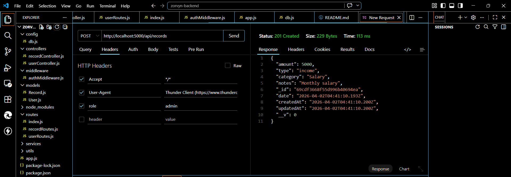
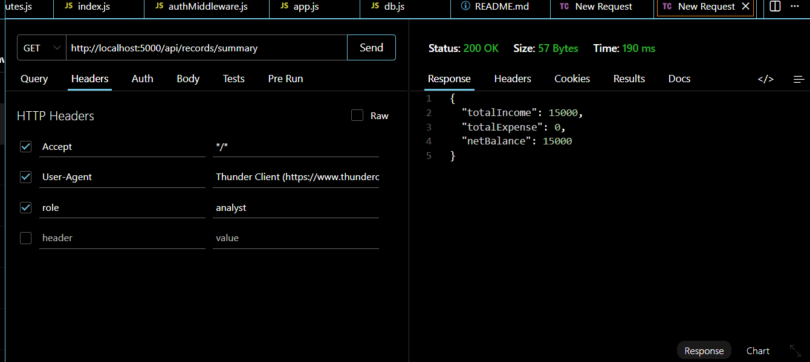
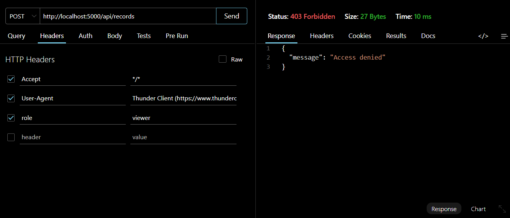

# 💰 Finance Dashboard Backend API

A backend system built using Node.js, Express, and MongoDB to manage financial transactions with role-based access control and analytics.

---

## 🚀 Features

* User Management (admin, analyst, viewer)
* Financial Records (income & expense tracking)
* Role-based Access Control
* Dashboard APIs:

  * Total income, expense, balance
  * Category-wise summary
  * Recent transactions

---

## 🛠 Tech Stack

* Node.js
* Express.js
* MongoDB (Mongoose)

---

## 📂 Project Structure

```
controllers/
models/
routes/
middleware/
config/
app.js
server.js
```

---

## ⚙️ Setup Instructions

```
npm install
npx nodemon server.js
```

---

## 🔐 Role-Based Access

* Admin → Full access
* Analyst → View + analytics
* Viewer → Read-only

---

## 🌐 API Endpoints

### Users

* POST /api/users
* GET /api/users

### Records

* POST /api/records (admin only)
* GET /api/records

### Dashboard

* GET /api/records/summary
* GET /api/records/category-summary
* GET /api/records/recent

---

## 📊 Sample Output

```
{
  "totalIncome": 5000,
  "totalExpense": 3000,
  "netBalance": 2000
}
```

---

## 💡 Notes

* Role is passed via headers:
  `role: admin / analyst / viewer`
* Clean modular architecture used
* Aggregation APIs implemented for analytics


## 📸 Screenshots

### Create Record


### Summary API


### Access Control


---

## 👨‍💻 Author

Steeve C Baby
